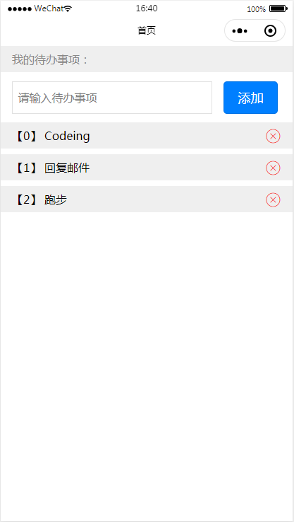

### 背景
使用Taro框架开发的微信小程序，当然你可以将此代码编译成各个小程序、H5、App版本，只要是Taro框架支持的。
该版本使用了`@tarojs/redux`管理状态。

### 技术栈
* Taro
* React
* Redux/`@tarojs/redux`
  
### [构建步骤](https://nervjs.github.io/taro/docs/GETTING-STARTED.html)
```js
# step 1
yarn dev:weapp

# step 2
yarn build:weapp

# step 3
打开微信小程序载入dist文件夹预览
```


### 效果展示

